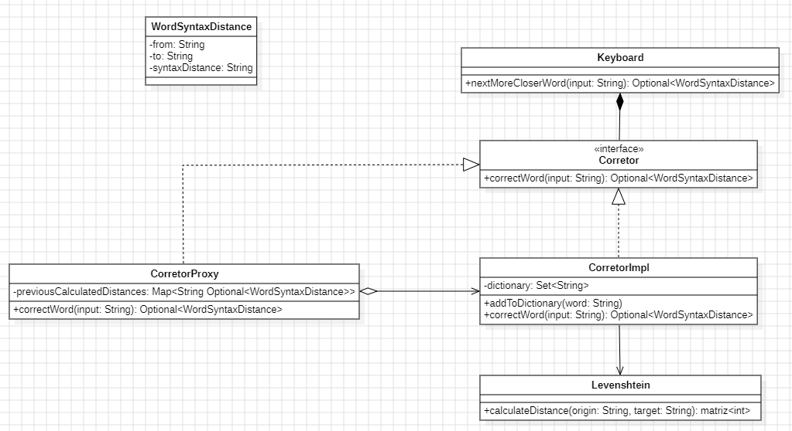

# Algoritmo de Levenshtein

## Conceito

O algoritmo de Levenshtein é utilizado para calcular a distância de edição entre duas strings **origin** e **target**. Em outras palavras,
o algoritmo nos ajuda a encontrar qual o número mínimo de operações necessárias para transformar **origin** em **target**. As operações são:

- Inserção de caractere: custo 1
- Remoção de caractere: custo 1
- Substituição de caractere: custo 1

É um método que usa conceitos de programação dinâmica na sua implementação.

## Implementação

A estrutura de dados base utilizada para a implementação do algoritmo é uma **matriz** de tamanho n + 1 x m + 1, onde n e m é o tamanho de **origin** e **target**
respectivamente. <\br>
Primeiro deve-se inicializar os valores da primeira linha e da primeira coluna da **matriz**: </br>

````java
int[][] operations = new int[first.length() + 1][second.length() + 1];
for (int i = 0; i <= first.length(); i++)
    operations[i][0] = i;
for (int i = 0; i <= second.length(); i++)
    operations[0][i] = i;
````

Dadas as palavras "pato" e "gato", a matriz ficará com o seguinte formato após a inicialização:</br>

````java
    0   1   2   3   4
    1
    2
    3
    4
````

Essa inicialização significa:

- Quantas operações são necessárias para transformar a palavra "pato" em uma string vazia. 4 operações de remoção
- Quantas operações são necessárias para transformar uma string vazia na palavra "gato". 4 operações de inserção

Esses valores serão usados posteriormente. Para calcular cada valor matriz é necessário usar a seguinte fórmula:

````java
cost = (first.charAt(i - 1) == second.charAt(j - 1)) ? 0 : 1;
int deletion = operations[i - 1][j] + 1; // Uma linha acima
int insertion = operations[i][j - 1] + 1; // Mesma linha na esquerda
int substitution = operations[i - 1][j - 1] + cost; // Na diagonal
operations[i][j] = Math.min(Math.min(deletion, insertion), substitution); // matriz[i][j] recebe o mínimo entre deletion, insertion e substitution
````

Em resumo, cada valor da matriz representa o número mínimo de operações a serem realizadas para transformar substring(**origin**, 0, i) em substring(**target**, 0, j).
A distância de edição entre **origin** e **target** é o elemento inferior mais a direita da matriz

## Design do corretor


